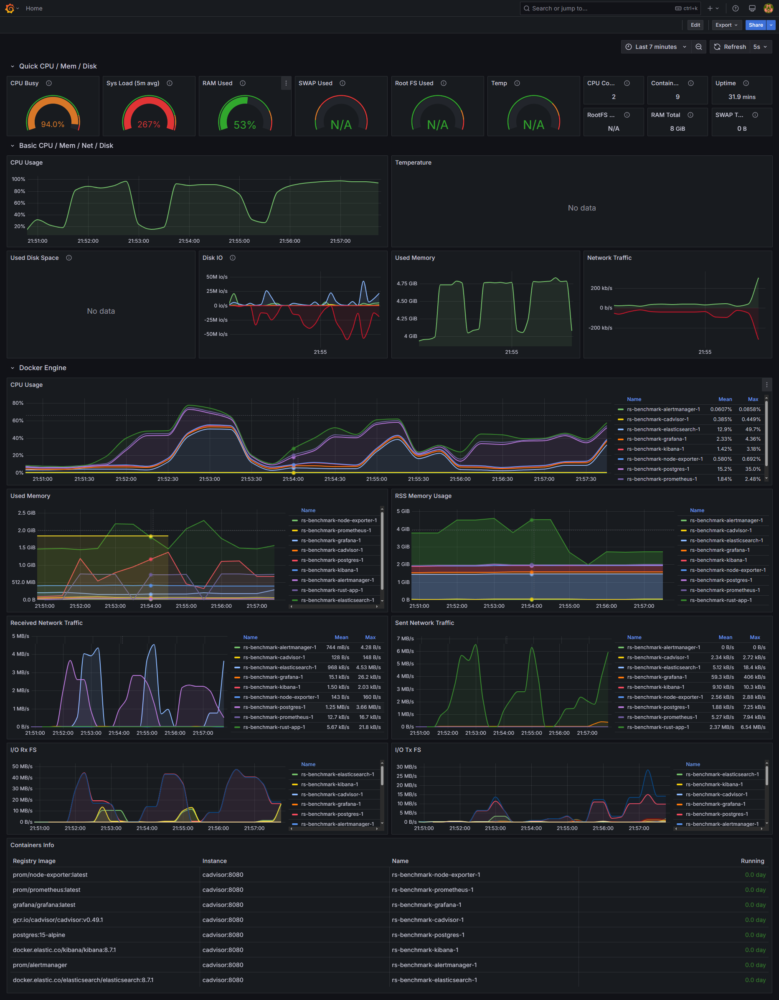
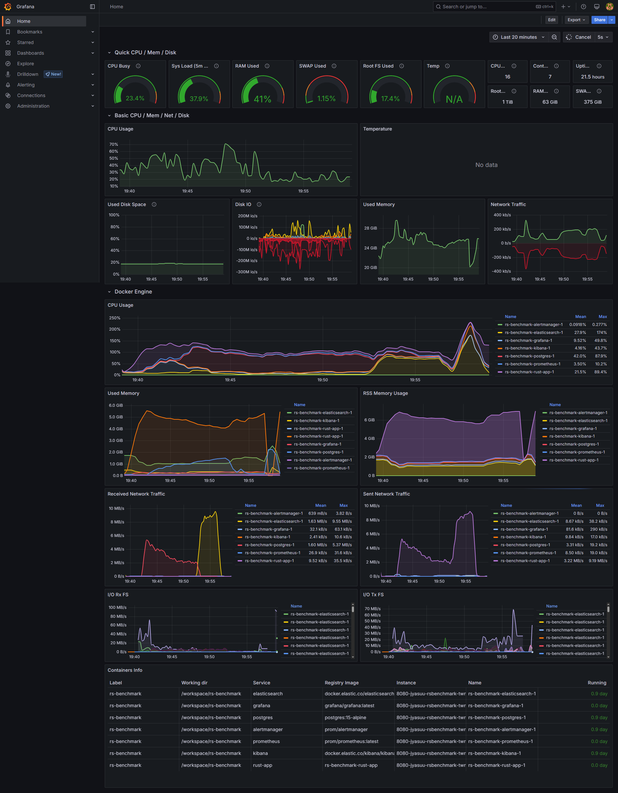

# rs-benchmark

```log
Starting benchmark...
Connecting to databases...
Connections established.
Setting up database schemas...
PostgreSQL table 'documents' and FTS index checked/created.
Elasticsearch index 'documents' already exists.
Schemas ready.
Generating 1000000 documents...
Generating 1000000 documents using Faker...
  [00:03:52] [########################################] 1000000/1000000 (0s)                                                                                                                                                                   Data generation took: 232.127456959s
Inserting data into PostgreSQL...
Updating FTS vectors in PostgreSQL...
FTS vector update took: 913.090081414s, updated 1000000 potential rows
PostgreSQL insertion took: 1313.202821801s
Inserting data into Elasticsearch...
Inserting 1000000 documents into Elasticsearch in batches of 500...
  [00:03:17] [########################################] 1000000/1000000 (0s) Elasticsearch insertion complete                                                                                               Refreshing Elasticsearch index...
Elasticsearch refresh took: 2.054401343s
Elasticsearch insertion took: 199.501397341s

Running PostgreSQL benchmarks...
Query                     | Count      | Latency (ms)   
------------------------------------------------------------
database performance      | 0          | 3.6650         
search engine             | 0          | 0.5858         
distributed systems       | 0          | 0.4968         
rust programming          | 0          | 0.5598         
benchmark results         | 0          | 0.6143         
lorem ipsum dolor         | 0          | 1.0891         
quick brown fox           | 0          | 0.5284         
quos quia                 | 10         | 127541.9861    
------------------------------------------------------------
PostgreSQL Average Latency: 15943.6906ms (8 queries, 10 total results)

Running Elasticsearch benchmarks...
Query                     | Count      | Latency (ms)   
------------------------------------------------------------
database performance      | 0          | 457.1389       
search engine             | 0          | 6.9412         
distributed systems       | 0          | 7.2847         
rust programming          | 0          | 4.1661         
benchmark results         | 0          | 4.3127         
lorem ipsum dolor         | 10         | 955.8011       
quick brown fox           | 0          | 4.0211         
quos quia                 | 10         | 521.1731       
------------------------------------------------------------
Elasticsearch Average Latency: 245.1049ms (8 queries, 20 total results)

Benchmark finished.
```


```log
Starting benchmark with JSONB focus...
Connecting to databases...
Connections established.
Setting up database schemas...
PostgreSQL table 'documents_jsonb' with JSONB column and GIN index checked/created.
Elasticsearch index 'documents_jsonb' already exists.
Schemas ready.
Generating 100000 documents...
Generating 100000 documents with tags and attributes...
  [00:00:28] [########################################] 100000/100000 (0s)                             Data generation took: 28.298672392s
Parsing JSON strings...
JSON parsing took: 3.301824512s
Inserting data into PostgreSQL (JSONB)...
Starting PostgreSQL COPY operation for 100000 documents...
  [00:00:21] [########################################] 100000/100000 (0s)                             PostgreSQL JSONB insertion took: 21.058748299s
Inserting data into Elasticsearch...
Inserting 100000 documents into Elasticsearch in batches of 1000...
  [00:00:19] [########################################] 100000/100000 (0s) Elasticsearch insertion complete                                                                                                   Refreshing Elasticsearch index...
Elasticsearch refresh took: 3.390854218s
Elasticsearch insertion took: 23.211148857s

Running PostgreSQL JSONB benchmarks...
Query Type                | Count      | Latency (ms)   
------------------------------------------------------------
tags @> 'rust'            | 0          | 6.2102         
attr ? 'att1'             | 10         | 0.9636         
attr nested = 'com'       | 10         | 1.4230         
attr att0 > 500           | 10         | 0.9151         
attr ? 'att_opt_1'        | 10         | 1.0248         
tags @> 'nonexistent'     | 0          | 4.9093         
------------------------------------------------------------
PostgreSQL Average Latency: 2.5743ms (6 queries, 40 total results)

Running Elasticsearch benchmarks...
Query Type                | Count      | Latency (ms)   
------------------------------------------------------------
tags: rust                | 0          | 2.6551         
exists: attributes.att1   | 10         | 3.5223         
attributes.att2.nested_key: com | 10         | 3.3047         
attributes.att0 > 500     | 10         | 9.8247         
exists: attributes.att_opt_1 | 10         | 4.4471         
tags: nonexistent         | 0          | 1.8081         
------------------------------------------------------------
Elasticsearch Average Latency: 4.2604ms (6 queries, 40 total results)

Benchmark finished.
```

```log
Starting benchmark with JSONB focus...
Connecting to databases...
Connections established.
Setting up database schemas...
PostgreSQL table 'documents_jsonb' with JSONB column and GIN index checked/created.
Elasticsearch index 'documents_jsonb' already exists.
Schemas ready.
Generating 1000000 documents...
Generating 1000000 documents with tags and attributes...
  [00:04:21] [########################################] 1000000/1000000 (0s)                           Data generation took: 261.454297585s
Parsing JSON strings...
JSON parsing took: 47.489257837s
Inserting data into PostgreSQL (JSONB)...
Starting PostgreSQL COPY operation for 1000000 documents...
  [00:07:15] [########################################] 1000000/1000000 (0s)                           PostgreSQL JSONB insertion took: 435.243793827s
Inserting data into Elasticsearch...
Inserting 1000000 documents into Elasticsearch in batches of 1000...
  [00:03:33] [########################################] 1000000/1000000 (0s) Elasticsearch insertion complete                                                                                                 Refreshing Elasticsearch index...
Elasticsearch refresh took: 2.053437569s
Elasticsearch insertion took: 215.171540213s

Running PostgreSQL JSONB benchmarks...
Query Type                | Count      | Latency (ms)   
------------------------------------------------------------
tags @> 'rust'            | 0          | 1.5742         
attr ? 'att1'             | 10         | 1.1110         
attr nested = 'com'       | 10         | 1.5932         
attr att0 > 500           | 10         | 0.6640         
attr ? 'att_opt_1'        | 10         | 0.6946         
tags @> 'nonexistent'     | 0          | 0.5573         
------------------------------------------------------------
PostgreSQL Average Latency: 1.0324ms (6 queries, 40 total results)

Running Elasticsearch benchmarks...
Query Type                | Count      | Latency (ms)   
------------------------------------------------------------
tags: rust                | 0          | 389.4453       
exists: attributes.att1   | 10         | 17.1993        
attributes.att2.nested_key: com | 10         | 180.3277       
attributes.att0 > 500     | 10         | 227.6713       
exists: attributes.att_opt_1 | 10         | 8.7950         
tags: nonexistent         | 0          | 5.2051         
------------------------------------------------------------
Elasticsearch Average Latency: 138.1073ms (6 queries, 40 total results)

Benchmark finished.
```

## monitoring




## FAQ

> Q: Error response from daemon: path / is mounted on / but it is not a shared or slave mount

> A: sudo mount --make-rshared /

sudo chmod 777 grafana/data/ -R
sudo chmod 777 prometheus/data/ -R

wget https://github.com/google/cadvisor/releases/download/v0.52.1/cadvisor-v0.52.1-linux-amd64
chmod +x cadvisor-v0.52.1-linux-amd64
sudo ./cadvisor-v0.52.1-linux-amd64
https://8080-jyasuu-rsbenchmark-twrlejodozg.ws-us118.gitpod.io/containers/

wget https://github.com/prometheus/node_exporter/releases/download/v1.9.1/node_exporter-1.9.1.linux-amd64.tar.gz
tar xzf node_exporter-1.9.1.linux-amd64.tar.gz
chmod +x cadvisor-v0.52.1-linux-amd64
sudo ./node_exporter-1.9.1.linux-amd64/node_exporter
https://9100-jyasuu-rsbenchmark-twrlejodozg.ws-us118.gitpod.io/

